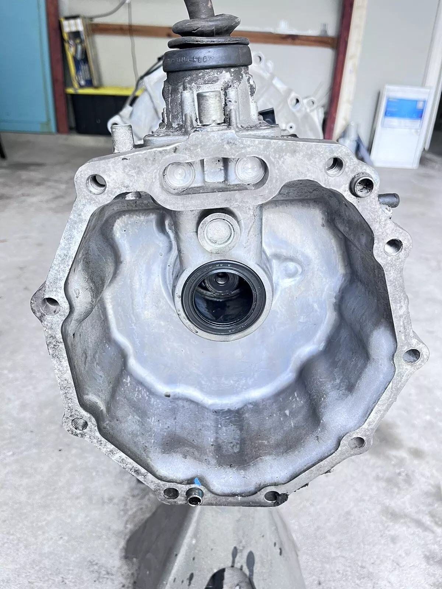
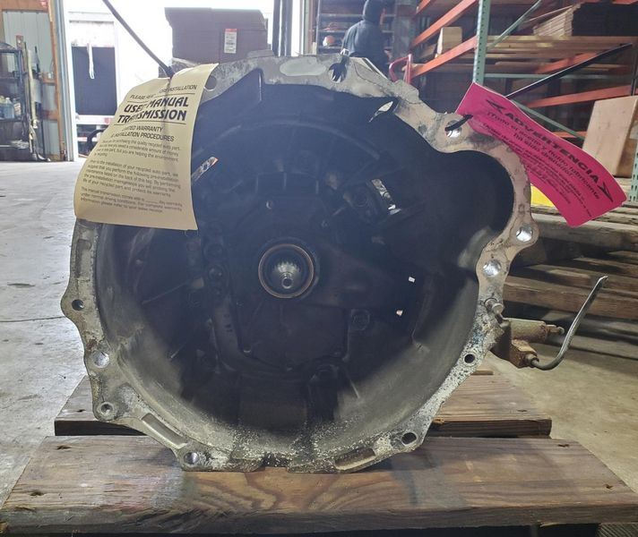
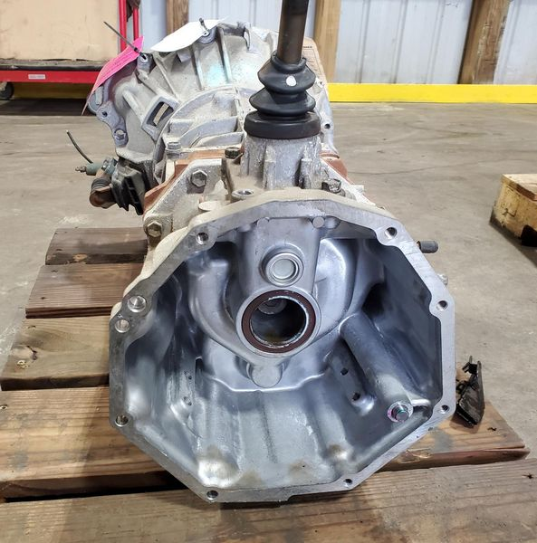
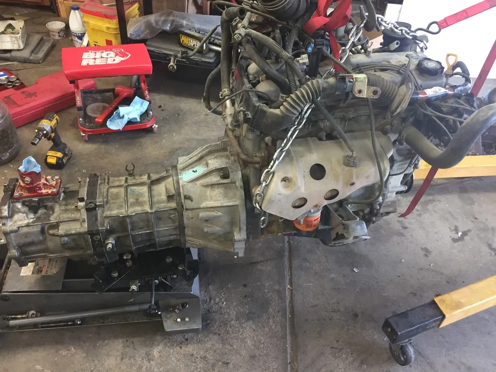
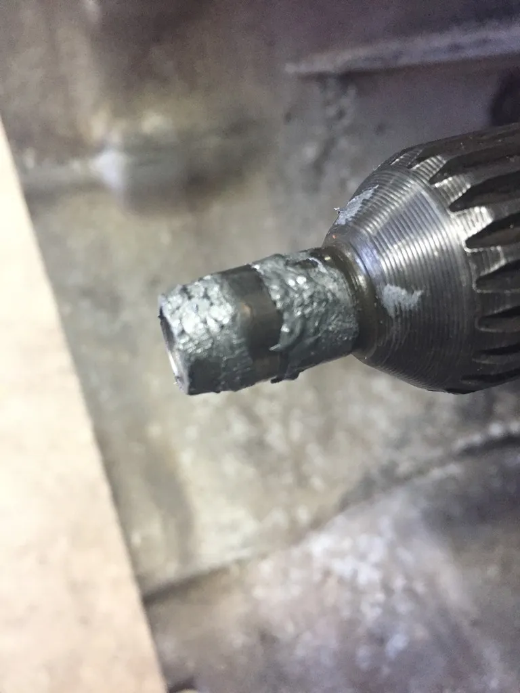

### See also
[drivetrain](drivetrain.md)
[toyotaVFTransferCaseNotes](toyotaVFTransferCaseNotes.md)

|                              | **R150F** 3VZ/5VZ              | **R151F** 22RET                  | R154           | **R155F** 2TR | **R156F** 2TR | AX15                   |
| ---------------------------- | ------------------------------ | -------------------------------- | -------------- | ------------- | ------------- | ---------------------- |
| **1st**                      | 3.83                           | 4.32                             | 3.25           | 3.95          | 4.31          | 3.83                   |
| **2nd**                      | 2.06                           | 2.33                             | 1.95           | 2.06          | 2.33          | 2.33                   |
| **3rd**                      | 1.44                           | 1.44                             | 1.32           | 1.44          | 1.44          | 1.44                   |
| **4th**                      | 1.00                           | 1.00                             | 1.00           | 1.00          | 1.00          | 1.00                   |
| **5th**                      | 0.84                           | 0.84                             | 0.75           | 0.81          | 0.79          | 0.79                   |
| **rev**                      | 4.22                           | 4.220                            | 3.18           | 4.22          | 4.22          | 4.22                   |
| **clutch diameter**       | 236mm / 9.25in                 | 250mm / 10in                     | 184mm / 7.25in | 250mm / 10in  | 250mm / 10in  | 279mm / 11in           |
| **bellhousing depth**  | 6.4in / 162mm                  | 6.4in / 162mm                    |                | 6.8in / 173mm | 6.8in / 173mm |                        |
| **starter location**   | upper passenger                | upper passenger                  | upper driver   | upper driver  | upper driver  | lower passenger        |
| **notes**                    | pickup / 4runner / 1gen tacoma | pickup / 4runner with 22RE turbo | supra / celica | tacoma 2gen   | tacoma 3gen   | jeeps with the 4.0L I6 |
### R150F (1988-1994)
- *Toyota 31111-35050 Housing, Clutch* is the part number for the early R150F found on 3VZFE Pickups and 4Runners (1988-1994)...photos below are the bell and tailhousing of an early R150F to be used with the VF1 transfer case
  

### R155F / R156F
- The *Toyota 31111-26073 Housing, Clutch* is the part for the bellhousing on 2TRFE Tacoma applications (2005-2017), bellhousing and tailhousing are the same on both transmissions...photos below
  
   
### Parts Compatibility
There is lots of evidence of the R151 being mounted the 3VZ or 5VZ using a 3VZ bellhousing to get a lower first gear and a tailhousing that natively accepts the RF1A transfer case. This implies (and there is evidence [here](https://www.pirate4x4.com/threads/some-r151-and-r150-hybrid-info.964093/)) that the early R150 and R151 share an input shaft. There is also evidence of the R151 being mounted to a 3RZ-FE engine which came originally with a W59 transmission. This is possible because the 3RZ and later 2TR share a bellhousing mounting pattern. In this application the early R150 bellhousing from a 3VZ application is used. Using a stock pilot bearing there is sufficient but less than ideal engagement between the pilot bearing and transmission input shaft. This is because the 2TR bellhousing and R155/R156 input shaft is slightly longer than the same parts in the early R150 by about 5mm to 8mm. Show below is a R151 installed to a 3RZ using an early R150 bellhousing. Note that by using some grease we can clearly see the input shaft installs about 10mm into the pilot bearing. For more engagement a deeper 14mm pilot bearing (pn 62201) can be used in lieu of the original (pn 90363-12002) 10mm deep pilot bearing. See post #11 [here](https://board.marlincrawler.com/index.php?topic=101408.0) for reference.

Per NorthwestFab in [this post](https://www.pirate4x4.com/posts/9090887/) the R151 bellhousing depth is 6.4in (~162mm) and the R155/R156 bellhousing is 6.8in (173mm). The difference is about 0.4in or 10mm, which roughly matches the previous estimation.

Per [Doomsday Diesel](https://www.doomsdaydiesel.net/product-page/vw-1-9-tdi-to-3vze-r150-adapter-kit) (TDI adapter swap kit company) the R155 can be used with their 3VZ to TDI swap kit by using a 3VZ bellhousing.
#### Conclusion (for my application R156F to a 3VZ/5VZ mounting pattern)
A R156F *should* mount directly to the bolt pattern that is on the back of the 3VZ or 5VZ engines (its the same on both). Worst case scenario it is possible that the input shaft may need up to 0.4in of material removed to fit since the early R150 bellhousing is slightly shorter than the R155/R156 bellhousing.

### 3rd gen Tacoma with R156 = TRN245 frame
Transmission mount - 123710C230 (engine mount rear insulator) 