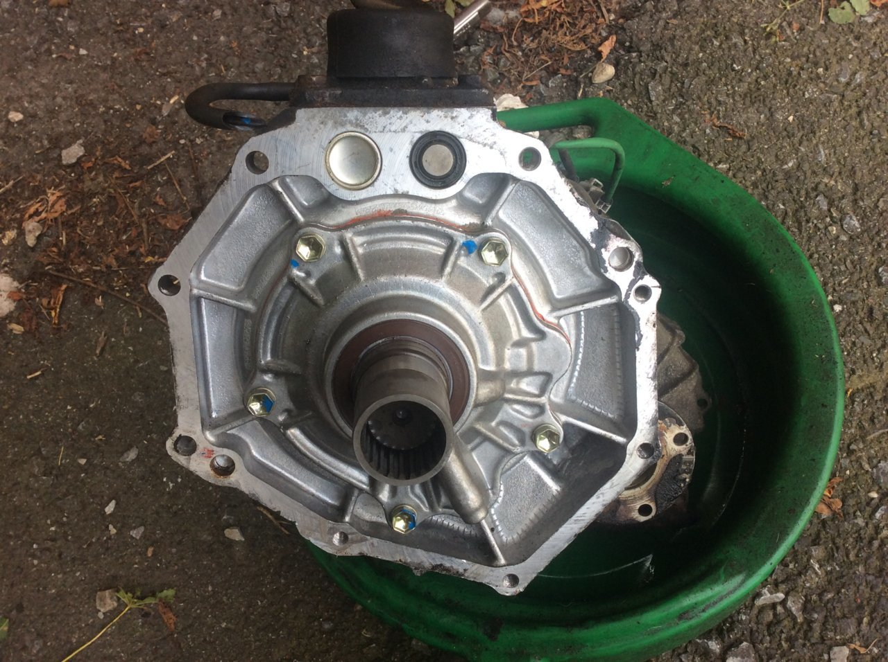
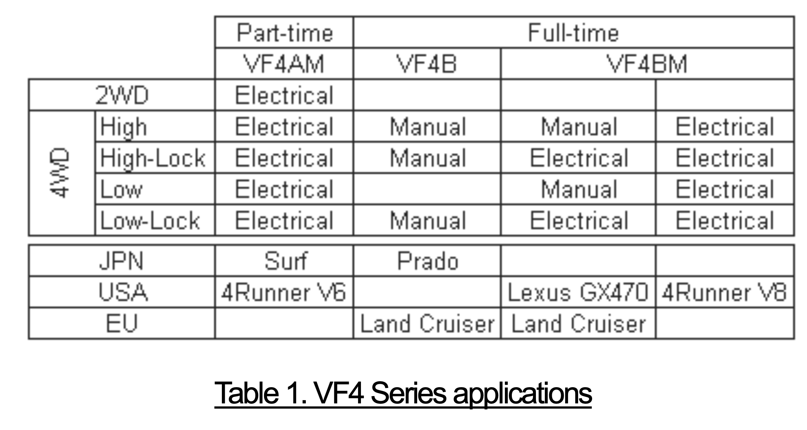
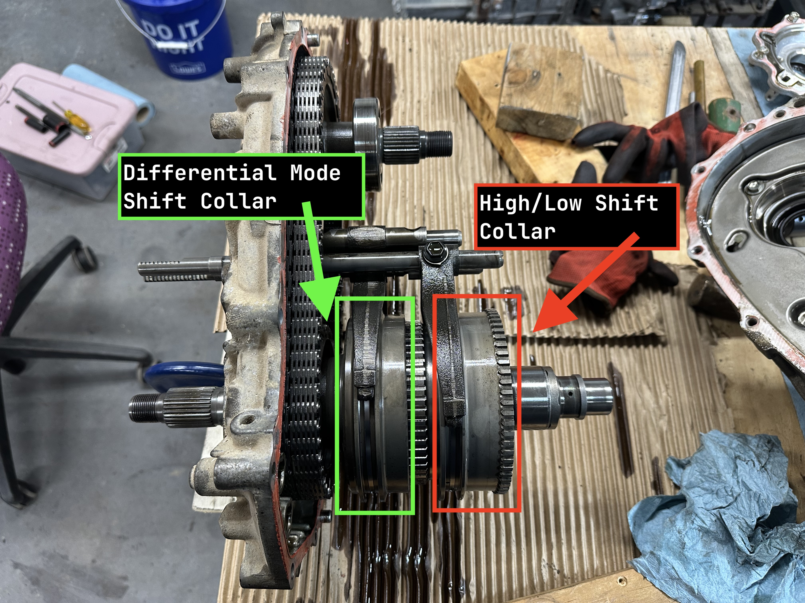
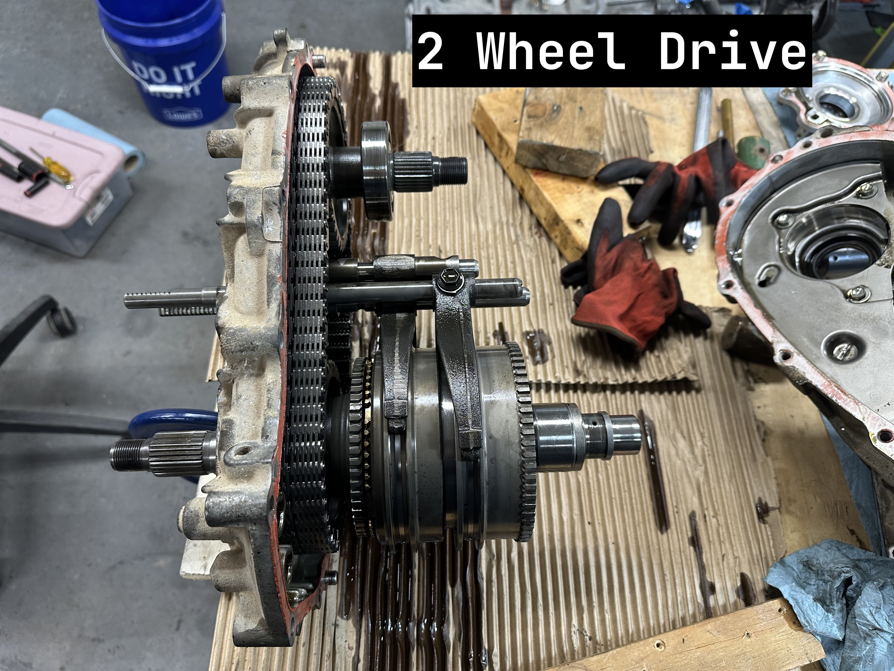
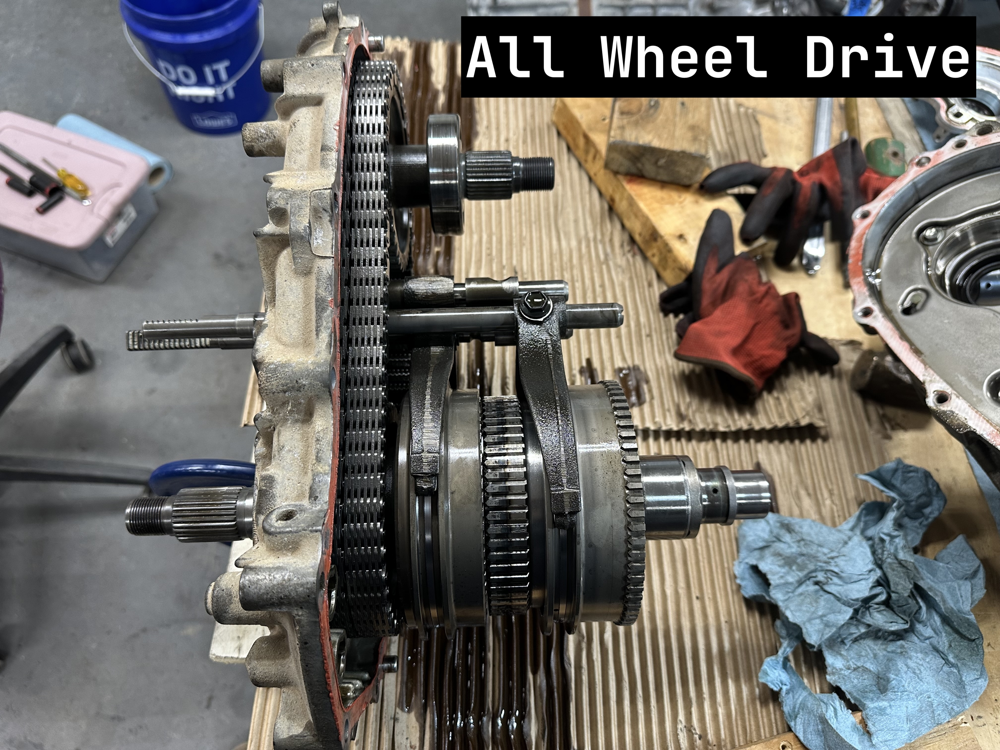
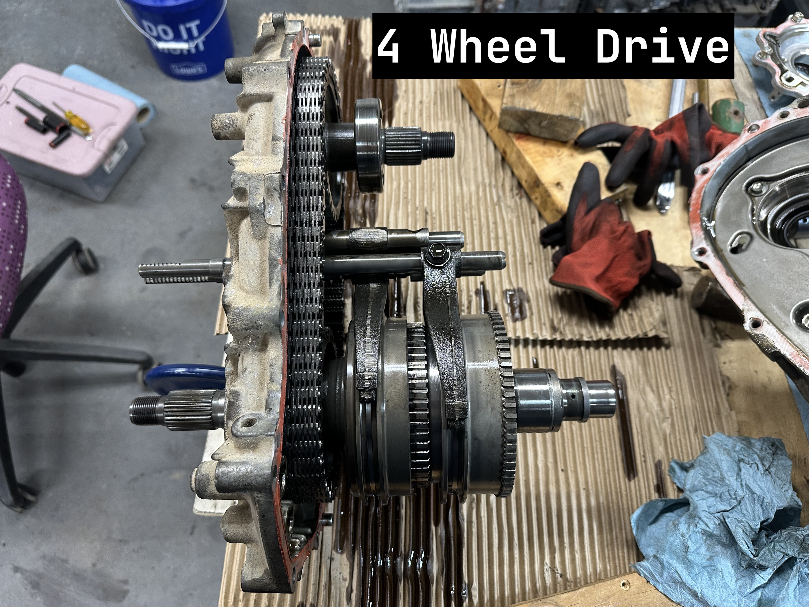
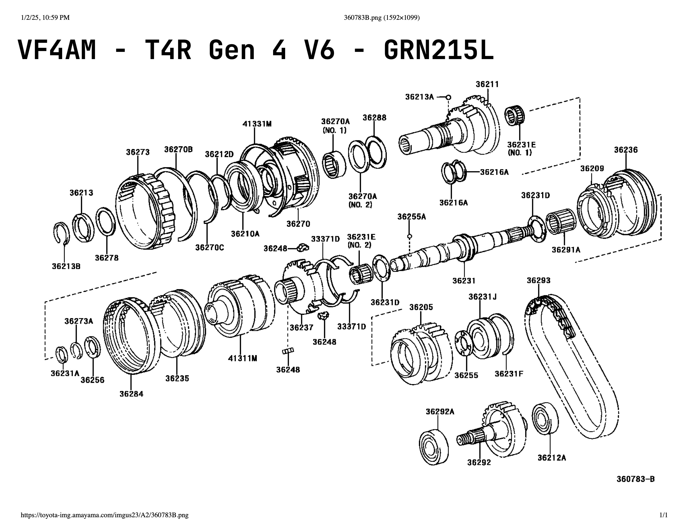
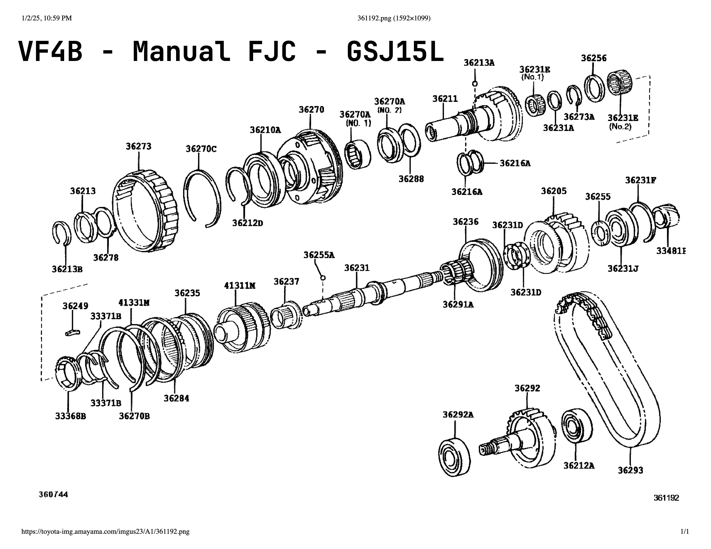
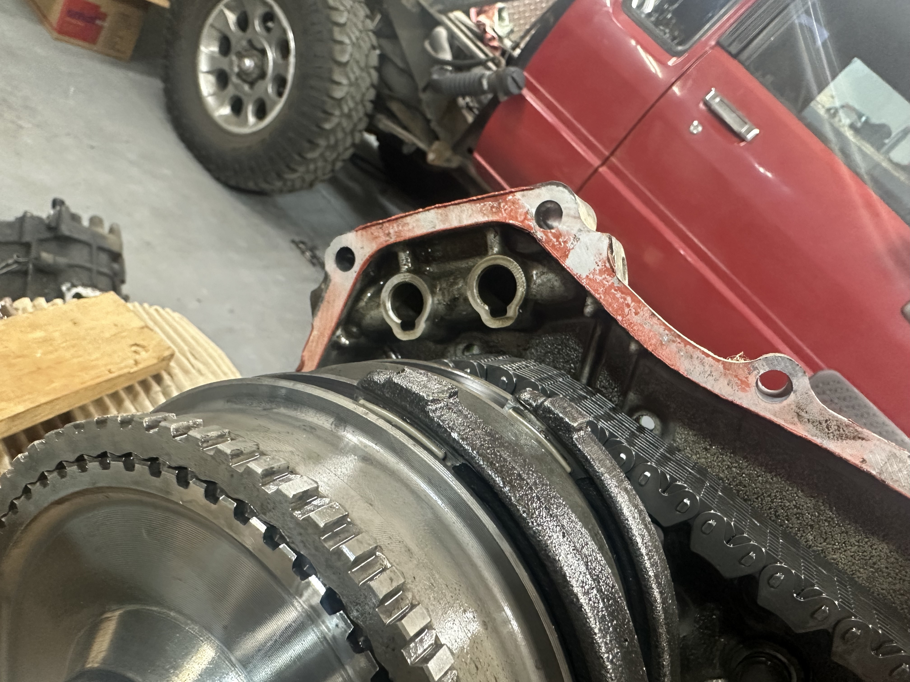
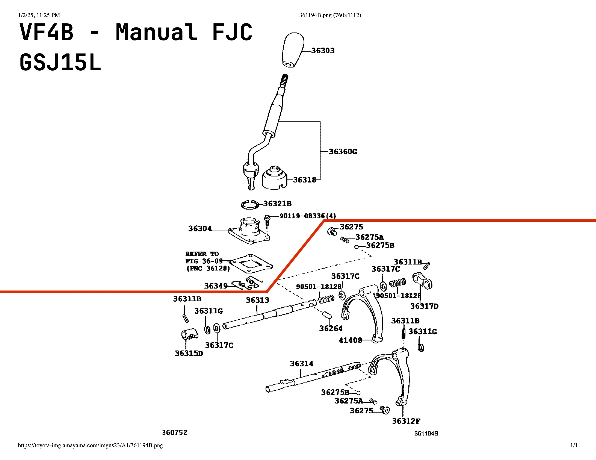

## see also
[drivetrain](drivetrain.md)
[toyotaRSeriesNotes](toyotaRSeriesNotes.md)
## VF (chain drive) transfer case summary
The VF series of transfer cases started in 1988 with the VF1 used in V6 applications of the Pickup and 4Runner (Hilux and Hilux Surf in international markets). I don't have any good source that this is the first use but all anecdotal evidence points to this. The VF cases differ from earlier RF cases by use of planetary reduction gears for high/low range selection and a chain driven output for the front output flange. RF cases used traditional gears for both of these functionThere are currently (as of Jan 2025) 4 major versions that have been produced, although not all are in production anymore. There are 3 distinct modes of operation that have been offered over the years, all 3 modes have a high and low range available. All VF cases that came installed to a R150 (or other R series) transmission, A340, or A750 share the same small diameter 23 spline input shaft. If it was installed to a RA60, RA61, RC60, RC61 (newer manual 6 speed) it will use larger diameter 22 spline input shaft ([source](https://www.tacomaworld.com/threads/transfer-case-transfer-cases-in-first-and-2nd-gen-trucks.345652/page-2#post-24959207)). The input shaft can be swapped between certain models of VF transfer case for use with a non-native transmission ([source](https://www.tacomaworld.com/threads/swapping-input-shafts-for-fj-case-for-manual-transmission.714337/)).

### VF series shift modes

| **Operational Type** | **2WD** | **AWD** | **4WD** |
| -------------------- | ------- | ------- | ------- |
| **Part Time 4WD**    | Yes     | No      | Yes     |
| **Multimode**        | Yes     | Yes     | Yes     |
| **Full Time 4WD**    | No      | Yes     | Yes     |
### A summary of VF series applications

|           | **2WD** | **AWD** | **4WD** | **Application**                                                                                           |
| --------- | ------- | ------- | ------- | --------------------------------------------------------------------------------------------------------- |
| **VF1**   | x       |         | x       | 3VZ equipped trucks/T4Rs                                                                                  |
| **VF2**   | x       |         | x       | Basically everything that's 2WD/4WD only (lots of applications in both manual and electric shift options) |
| **VF3AM** | x       | x       | x       | 3rd gen T4Rs with mulitmode and early 1st gen Sequoias                                                    |
| **VF4AM** | x       | x       | x       | 4th gen T4R V6 models and late 1st gen sequoia                                                            |
| **VF4B**  |         | x       | x       | Manual FJ Cruiser, Fortuner (international), Prado (international)                                        |
| **VF4BM** |         | x       | x       | 4th gen T4R V8, 5th gen T4R limited, GX470, GX460                                                         |
### VF1
This was the first VF case and is the only one that was produced with a front output flange on the passenger side. It is a part time case and mounts to R150 and A340 transmissions from V6 (3VZFE) 2nd/3rd generation Pickups and 1st/2nd generation 4Runners. All VF1 cases are manually shifted with a lever on the floor of the cab.
### VF2
The second VF case which started the tradition of placing the front output flange on the driver side. The VF2 was released with 1st generation Tacoma and 3rd generation 4Runner. Early VF2 cases were manually shifted with a lever on the floor of the cab but starting with the 2nd generation Tacoma most VF2 versions moved to electric shift via dial mounted to the dash. The notable exception to this rule is the VF2 found in automatic FJ Cruisers, which has a manual lever in the center console. The VF2CM is still used today (as of Jan 2025) in all light duty Toyota's with part time 4WD in the North American market. The following table uses sources from forum posts, the specific sub-models (A/B/AM/BM) could be confirmed (but I don't really care to) with a parts diagram for a given production frame number on a parts site ([Amayama](https://www.amayama.com/)/[Megazip](https://www.megazip.net)/[PartSouq](https://partsouq.com)).

| **Version** | **Shift Mode**                                                                                                                                         |
| ----------- | ------------------------------------------------------------------------------------------------------------------------------------------------------ |
| **VF2A**    | Lever shifted - Early VF2 applications ([source](https://www.toyota-4runner.org/2024998-post6.html))                                                   |
| **VF2B**    | Lever shifted - Automatic FJ Cruiser ([source](https://www.tacomaworld.com/threads/difference-between-vf2bm-and-vf2b.225516/#post-5267221))            |
| **VF2BM**   | Electrically shifted - Most newish applications ([source](https://www.tacomaworld.com/threads/difference-between-vf2bm-and-vf2b.225516/#post-5267221)) |
| **VF2CM**   | Electrically shifted - Most new applicatoins ([source](https://www.tacomaworld.com/threads/%E2%80%9816-newer-transfer-cases.636057/))                  |
### VF3AM
The third major VF version in the VF3AM, which was only produced in 1 version as far as I am aware. This is the first multimode case and it uses a lockable open differential for an AWD mode. It was used in 1998-1999 Limited 4Runners, all 2001-2002 4Runners ([source](https://www.toyota-4runner.org/669885-post1.html)), and the 2001-2004 Sequoia ([source](https://www.tundrasolutions.com/posts/376184/)). Operation is a combination of manual and electric shifting, where high/low range is operated with a lever in the cab and the AWD and differential locking for 4WD is shifted with an electric actuator controlled by buttons and a control computer. This case used a unique mounting flange that is not compatible with newer VF4 style transmission tailhousings. It may or may not be compatible with other transmissions from the same family of vehicles it was offered with, I haven't checked and I probably never will.

### VF4
The VF4 series is the most recently developed major version and is in my opinion the most advanced of the family. The largest improvement of the VF4 is the use of a Torsen type differential instead of the open differential that was used in the VF3. Here is a great [Toyota research paper](ref/vf4TorsenToyotaResearchPaper.pdf) on why this is better. There are 2 major versions of the VF4, the multimode VF4AM which only came in one variant and the full time 4WD VF4B which was offered in multiple versions, see the following excerpt from the [research paper](ref/vf4TorsenToyotaResearchPaper.pdf). For more info on the VF4 series of transfer cases [this presentation](ref/vf4DifferentialPresentation.pdf) has a good breakdown of internals, shift modes, and differences from other case types.

## VF4AM Operational Deep Dive
The front half of the VF4 case has the planetary gears that handle the high/low modes. The output of the high/low range planetaries interface with the input to the Torsen differential. In the factory configuration the 4WD computer prevents the use of low range with either 2WD or AWD.
 
The rear half of the case has the 2 shift collars with their associated shift forks. The high/low collar is the one that engages with the planetaries in the front of the case to select high or low. There is also a neutral between high and low, but it is not selectable in the factory configuration through the 4WD system. The differential mode shift collar slides between the differential input gear, differential output gear, and front output flange drive gear. The right side of the following image is the engine side, the shaft on the lower left is where the rear output flange is installed, and the shaft on the top is where the front output flange goes.

#### !!!! PUT A PICTURE OF THE GEARS WITHOUT THE SHIFT COLLARS HERE WITH NOTE ABOUT THE BRONZE SHIFT ON THE FLY GEAR!!!!
In 2WD the differential input is locked to the differential output by the shift collar while leaving the front output flange drive gear disconnect. This bypasses the differential and the transfer case functions like a part time case.

In AWD the front output flange is locked to the differential output gear. Since the differential input gear is part of the rear output flange shaft this allows the front and rear driveshafts to spin at a differential rate, enabling all wheel drive.

In 4WD differential input, differential output, and front output drive gear are all locked together. This bypasses the differential while powering the front output shaft, enabling traditional four wheel drive.

The VF4B is essentially the same case except it is missing the option to disconnect the front output drive gear from the differential. Essentially the front output drive gear is permanently connected to the differential output gear, so the only shift option is coupling the differential input and output gears together to engage 4WD. Note the VF4AM has an extra gear (#36237) after the differential assembly (#41331M).

## VF4AM top shift conversion
### Normal Operation
"On the VF4AM there are 3 shafts - 2 moveable and 1 fixed. The H-L is basically the same as the Tacoma, again using a planetary reduction, the interesting part is the second shaft, which has 3 positions, 2-4F-4L floats the fork on the shaft with end stops (using snap rings) with the shaft using interlock pins to sliders on the fixed shaft prevent the fork from moving in all 3 locations. It's pretty cool ([source](https://www.tacomaworld.com/threads/transfer-case-question.711816/#post-25317689))". [This video](https://www.youtube.com/watch?v=XKFrZr6EcK0) is a good visual of how the transfer case shifts in the factory configuration with the electric actuator. Here is [another good video](https://www.youtube.com/watch?v=ESm0PPBkAQQ&t=1187s) that does a deep dive on transfer case operation, conveniently the AWD demonstration uses the internals from a VF4AM. The following diagrams of the transfer case internals are available on the parts websites found under [this section](#Frame codes for the donors)
### Conversion Overview
Although the VF4AM is an electrically shifted transfer case the rear housing has machined pockets to guide rails for a manual top shifting mechanism. The housing also has the shifter mounting area machined, although in an electric shift application it is covered with a plate containing a small pressure relief vent instead of a shifter. The remainder of the housing has castings for the top shift rail detents and locations for the front clearance holes for the movement in the top shift rails. Since the FJ Cruiser uses a version of this case with a top shift mechanism to convert the case I simply need to add these machined features, add the top shifting rail mechanism from a FJ Cruiser, and adjust the detents in the FJ Cruiser shift rails as needed so the shifter snaps into the correct position for this particular case.

### Frame codes for the donors
Use the frame codes get detailed parts and diagrams from any of the following sources:
- [Amayama](https://www.amayama.com/)
- [Megazip](https://www.megazip.net)
- [PartSouq](https://partsouq.com)
FJ Cruiser w/ RA61F 6 speed and fully manual VF4B
- GSJ15L
- reference VIN from salvage site - JTEBU11F970052528)
4th gen 4Runner w/ 1GRFE, A750, and fully electric VF4AM
- GRN215
- currently no reference vin
### Required Parts
The following parts were ordered using the parts diagram for the shifter assembly of a GSJ15L frame FJ Cruiser. All the parts below the red line will be needed with the exception of `90250-10020 - PIN OR ROLLER, SHIFT INTER-LOCK`, which is only necessary if a factory style single shifter will be used. I will be using a twin stick setup to independently control each shift rail.

| Part Number | Description                                 | Quantity |
| ----------- | ------------------------------------------- | -------- |
| 36302-60190 | FORK, TRANSFER GEAR SHIFT, NO.2             | 1        |
| 36313-60140 | SHAFT, TRANSFER FRONT DRIVE SHIFT           | 1        |
| 36314-60120 | SHAFT, TRANSFER HIGH AND LOW SHIFT FORK     | 1        |
| 36315-60030 | HEAD, TRANSFER GEAR SHIFT, NO.1             | 1        |
| 36317-35020 | STOPPER, TRANSFER SHIFT SHAFT               | 3        |
| 36317-60020 | STOPPER, NO.2, TRANSFER SHIFT SHAFT         | 1        |
| 41408-60030 | FORK SUB-ASSY, CENTER DIFFERENTIAL LOCK     | 1        |
| 90250-10020 | PIN OR ROLLER, SHIFT INTER-LOCK             | 1        |
| 90254-05001 | PIN                                         | 3        |
| 90311-15008 | SEAL, OIL                                   | 2        |
| 90341-12014 | PLUG (FOR REVERSE RESTRICT PIN)             | 2        |
| 90360-10003 | BALL (FOR 2ND GEAR BUSH)                    | 2        |
| 90501-16116 | SPRING, COMPRESSION (FOR SHIFT DETENT BALL) | 2        |
| 90501-18128 | SPRING, COMPRESION (FOR SHIFT FORK)         | 2        |
| 90520-13002 | RING, SNAP                                  | 2        |

### Conversion Process
Work in progress, above parts are on order.