## see also
[drivetrain](drivetrain.md)  
[toyotaRSeriesNotes](toyotaRSeriesNotes.md)
## VF (chain drive) transfer case summary
The VF series of transfer cases started in 1988 with the VF1 used in V6 applications of the Pickup and 4Runner (Hilux and Hilux Surf in international markets). I don't have any good source that this is the first use but all anecdotal evidence points to this. The VF cases differ from earlier RF cases by use of planetary reduction gears for high/low range selection and a chain driven output for the front output flange. RF cases used traditional gears for both of these functionThere are currently (as of Jan 2025) 4 major versions that have been produced, although not all are in production anymore. There are 3 distinct modes of operation that have been offered over the years, all 3 modes have a high and low range available. All VF cases that came installed to a R150 (or other R series) transmission, A340, or A750 share the same small diameter 23 spline input shaft. If it was installed to a RA60, RA61, RC60, RC61 (newer manual 6 speed) it will use larger diameter 22 spline input shaft ([source](https://www.tacomaworld.com/threads/transfer-case-transfer-cases-in-first-and-2nd-gen-trucks.345652/page-2#post-24959207)). The input shaft can be swapped between certain models of VF transfer case for use with a non-native transmission ([source](https://www.tacomaworld.com/threads/swapping-input-shafts-for-fj-case-for-manual-transmission.714337/)).

### VF series shift modes

| **Operational Type** | **2WD** | **AWD** | **4WD** |
| -------------------- | ------- | ------- | ------- |
| **Part Time 4WD**    | Yes     | No      | Yes     |
| **Multimode**        | Yes     | Yes     | Yes     |
| **Full Time 4WD**    | No      | Yes     | Yes     |
### A summary of VF series applications

|           | **2WD** | **AWD** | **4WD** | **Application**                                                                                           |
| --------- | ------- | ------- | ------- | --------------------------------------------------------------------------------------------------------- |
| **VF1**   | x       |         | x       | 3VZ equipped trucks/T4Rs                                                                                  |
| **VF2**   | x       |         | x       | Basically everything that's 2WD/4WD only (lots of applications in both manual and electric shift options) |
| **VF3AM** | x       | x       | x       | 3rd gen T4Rs V6 (with mulitmode) and early 1st gen Sequoias                                               |
| **VF4AM** | x       | x       | x       | 4th gen T4R V6 models and late 1st gen sequoia (2005-2007)                                                |
| **VF4B**  |         | x       | x       | Manual FJ Cruiser, Fortuner (international), Prado (international)                                        |
| **VF4BM** |         | x       | x       | 4th gen T4R V8, 5th gen T4R limited, GX470, GX460                                                         |
### VF1
This was the first VF case and is the only one that was produced with a front output flange on the passenger side. It is a part time case and mounts to R150 and A340 transmissions from V6 (3VZFE) 2nd/3rd generation Pickups and 1st/2nd generation 4Runners. All VF1 cases are manually shifted with a lever on the floor of the cab.
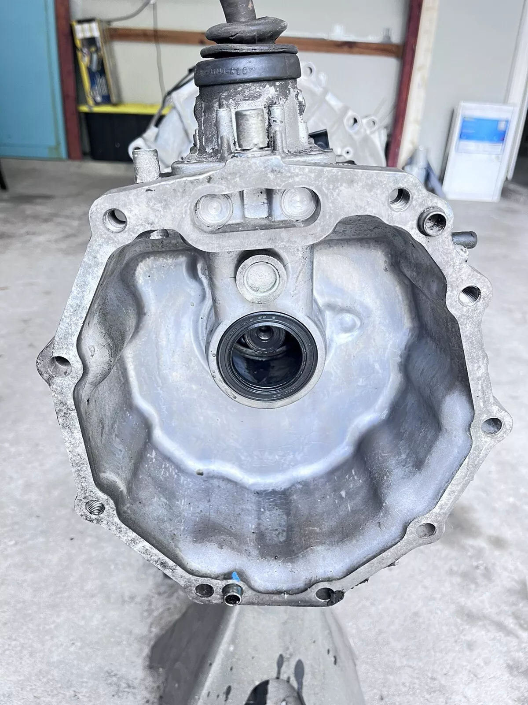

### VF2
The second VF case which started the tradition of placing the front output flange on the driver side. The VF2 was released with 1st generation Tacoma and 3rd generation 4Runner. Early VF2 cases were manually shifted with a lever on the floor of the cab but starting with the 2nd generation Tacoma most VF2 versions moved to electric shift via dial mounted to the dash. The notable exception to this rule is the VF2 found in automatic FJ Cruisers, which has a manual lever in the center console. The VF2CM is still used today (as of Jan 2025) in all light duty Toyota's with part time 4WD in the North American market. The following table uses sources from forum posts, the specific sub-models (A/B/AM/BM) could be confirmed (but I don't really care to) with a parts diagram for a given production frame number on a parts site ([Amayama](https://www.amayama.com/)/[Megazip](https://www.megazip.net)/[PartSouq](https://partsouq.com)).

| **Version** | **Shift Mode**                                                                                                                                         |
| ----------- | ------------------------------------------------------------------------------------------------------------------------------------------------------ |
| **VF2A**    | Lever shifted - Early VF2 applications ([source](https://www.toyota-4runner.org/2024998-post6.html))                                                   |
| **VF2B**    | Lever shifted - Automatic FJ Cruiser ([source](https://www.tacomaworld.com/threads/difference-between-vf2bm-and-vf2b.225516/#post-5267221))            |
| **VF2BM**   | Electrically shifted - Most newish applications ([source](https://www.tacomaworld.com/threads/difference-between-vf2bm-and-vf2b.225516/#post-5267221)) |
| **VF2CM**   | Electrically shifted - Most new applicatoins ([source](https://www.tacomaworld.com/threads/%E2%80%9816-newer-transfer-cases.636057/))                  |
### VF3AM
The third major VF version in the VF3AM, which was only produced in 1 version as far as I am aware. This is the first multimode case and it uses a lockable open differential for an AWD mode. It was used in 1998-1999 Limited 4Runners, all 2001-2002 4Runners ([source](https://www.toyota-4runner.org/669885-post1.html)), and the 2001-2004 Sequoia ([source](https://www.tundrasolutions.com/posts/376184/)). Operation is a combination of manual and electric shifting, where high/low range is operated with a lever in the cab and the AWD and differential locking for 4WD is shifted with an electric actuator controlled by buttons and a control computer. This case used a unique mounting flange that is not compatible with newer VF4 style transmission tailhousings. It may or may not be compatible with other transmissions from the same family of vehicles it was offered with, I haven't checked and I probably never will.
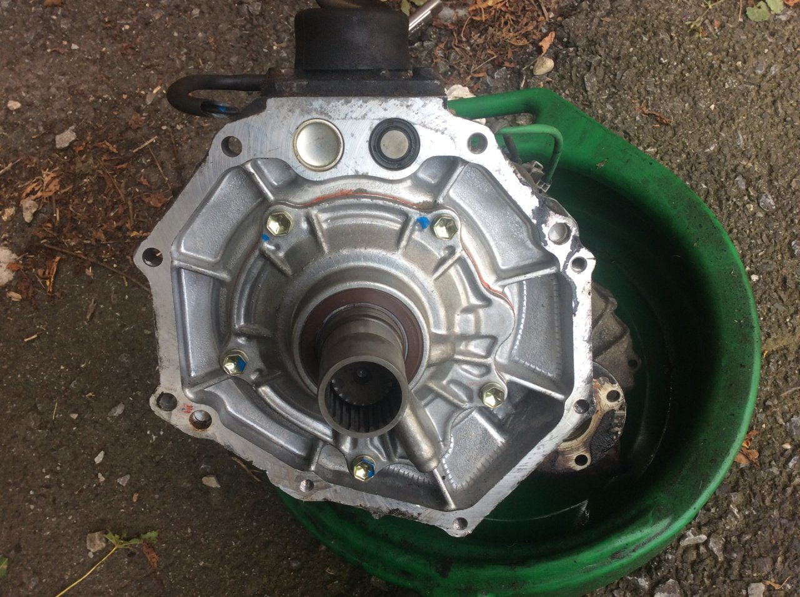
### VF4
The VF4 series is the most recently developed major version and is in my opinion the most advanced of the family. The largest improvement of the VF4 is the use of a Torsen type differential instead of the open differential that was used in the VF3. Here is a great [Toyota research paper](ref/vf4TorsenToyotaResearchPaper.pdf) on why this is better. There are 2 major versions of the VF4, the multimode VF4AM which only came in one variant and the full time 4WD VF4B which was offered in multiple versions, see the following excerpt from the [research paper](ref/vf4TorsenToyotaResearchPaper.pdf). For more info on the VF4 series of transfer cases [this presentation](ref/vf4DifferentialPresentation.pdf) has a good breakdown of internals, shift modes, and differences from other case types.
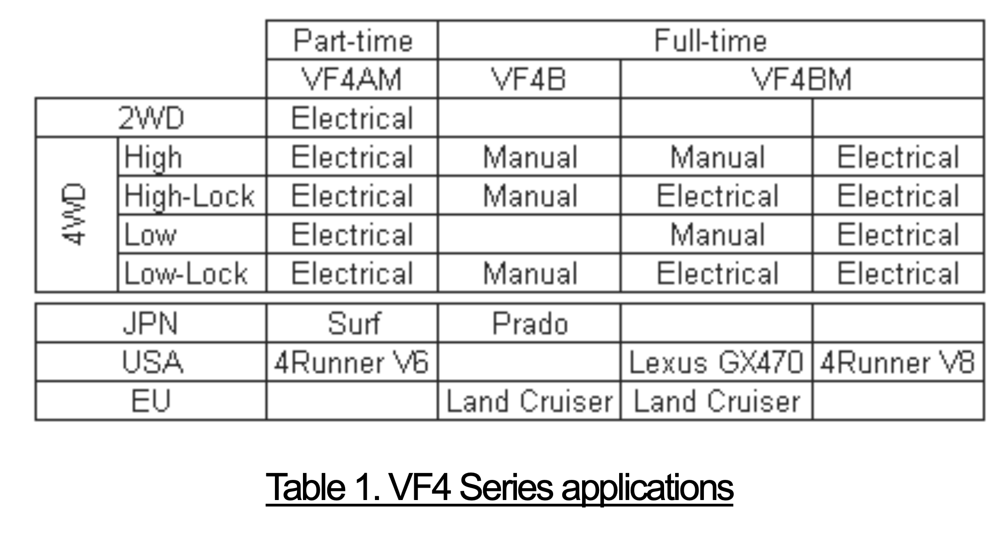
## VF4AM Operational Deep Dive
The front half of the VF4 case has the planetary gears that handle the high/low modes. The output of the high/low range planetaries interface with the input to the Torsen differential. In the factory configuration the 4WD computer prevents the use of low range with either 2WD or AWD.
 
The rear half of the case has the 2 shift collars with their associated shift forks. The high/low collar is the one that engages with the planetaries in the front of the case to select high or low. There is also a neutral between high and low, but it is not selectable in the factory configuration through the 4WD system. The differential mode shift collar slides between the differential input gear, differential output gear, and front output flange drive gear. The right side of the following image is the engine side, the shaft on the lower left is where the rear output flange is installed, and the shaft on the top is where the front output flange goes.
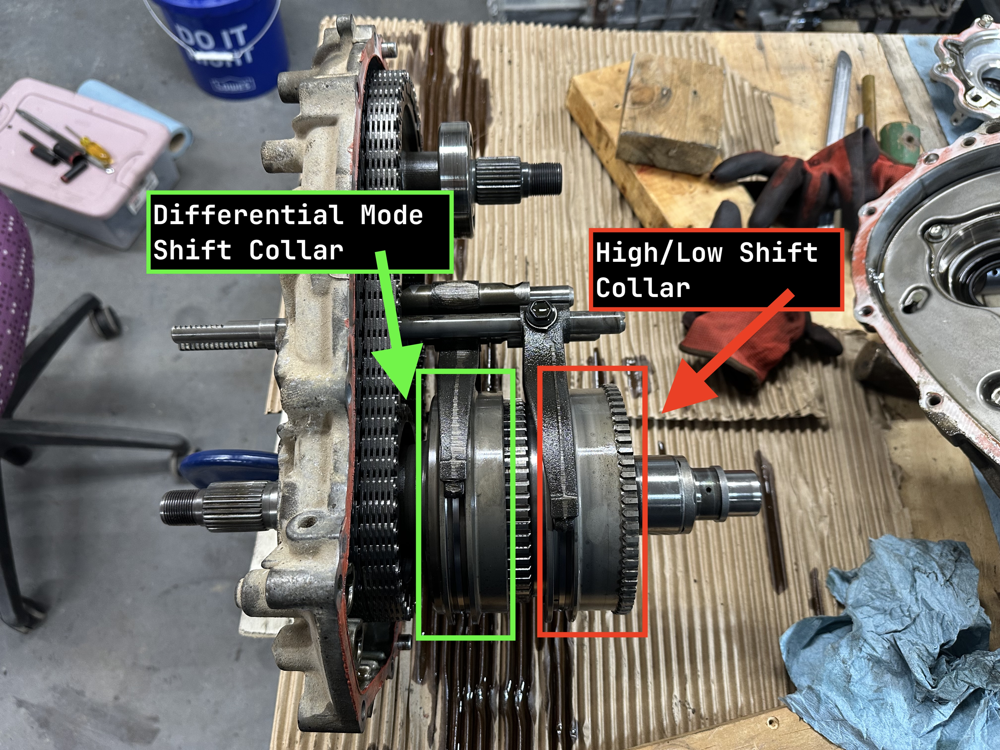
The differential input gear, differential output gear, and front output flange drive gear. It is hard to see but there is a bronze bushing between the differential output gear and the front output gear (between the orange and blue boxes), I think this functions as a syncro enables shift-on-the-fly from 2WD to AWD.
#### 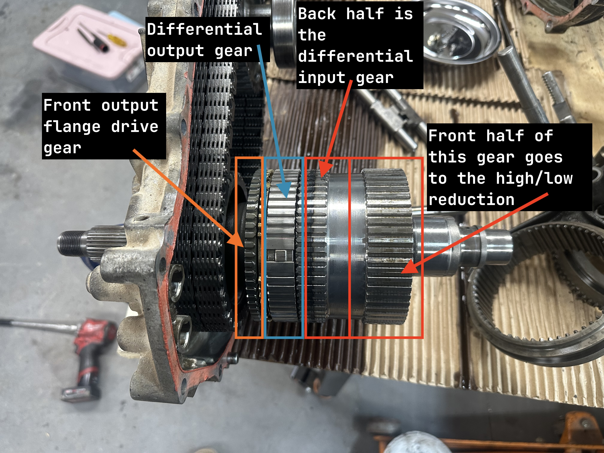

In 2WD the differential input is locked to the differential output by the shift collar while leaving the front output flange drive gear disconnect. This bypasses the differential and the transfer case functions like a part time case.
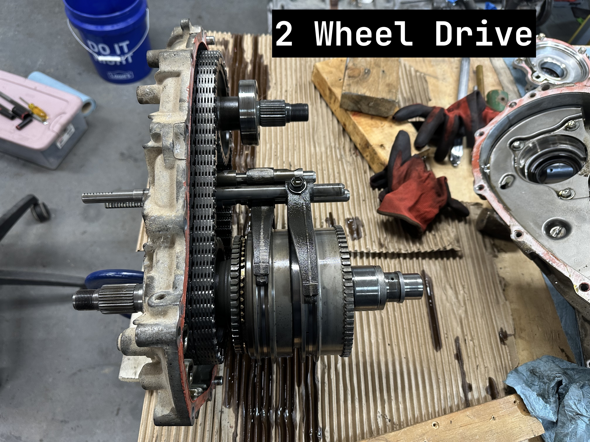
In AWD the front output flange is locked to the differential output gear. Since the differential input gear is part of the rear output flange shaft this allows the front and rear driveshafts to spin at a differential rate, enabling all wheel drive.
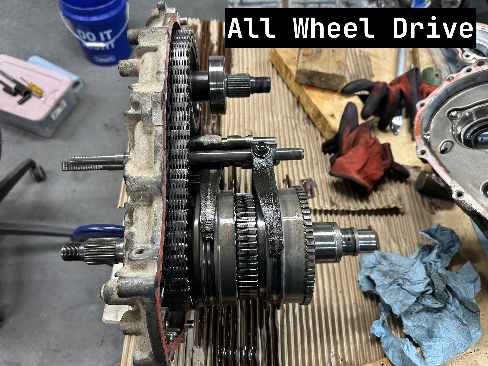
In 4WD differential input, differential output, and front output drive gear are all locked together. This bypasses the differential while powering the front output shaft, enabling traditional four wheel drive.
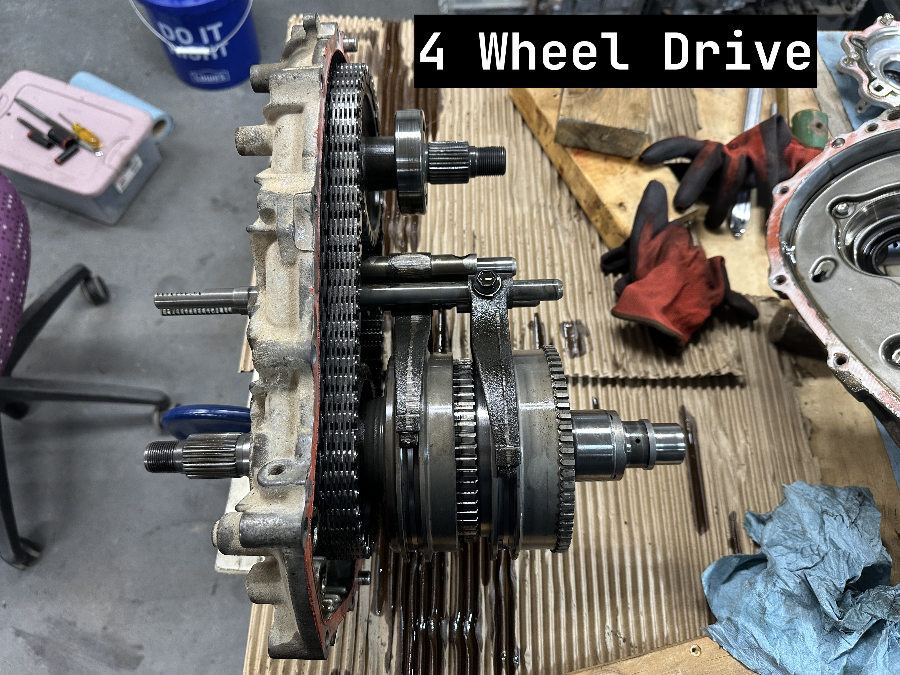
The VF4B is essentially the same case except it is missing the option to disconnect the front output drive gear from the differential. Essentially the front output drive gear is permanently connected to the differential output gear, so the only shift option is coupling the differential input and output gears together to engage 4WD. Note the VF4AM has an extra gear (#36237) after the differential assembly (#41331M).
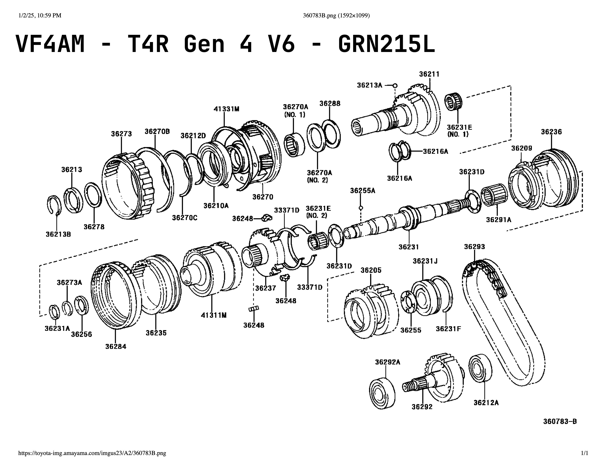
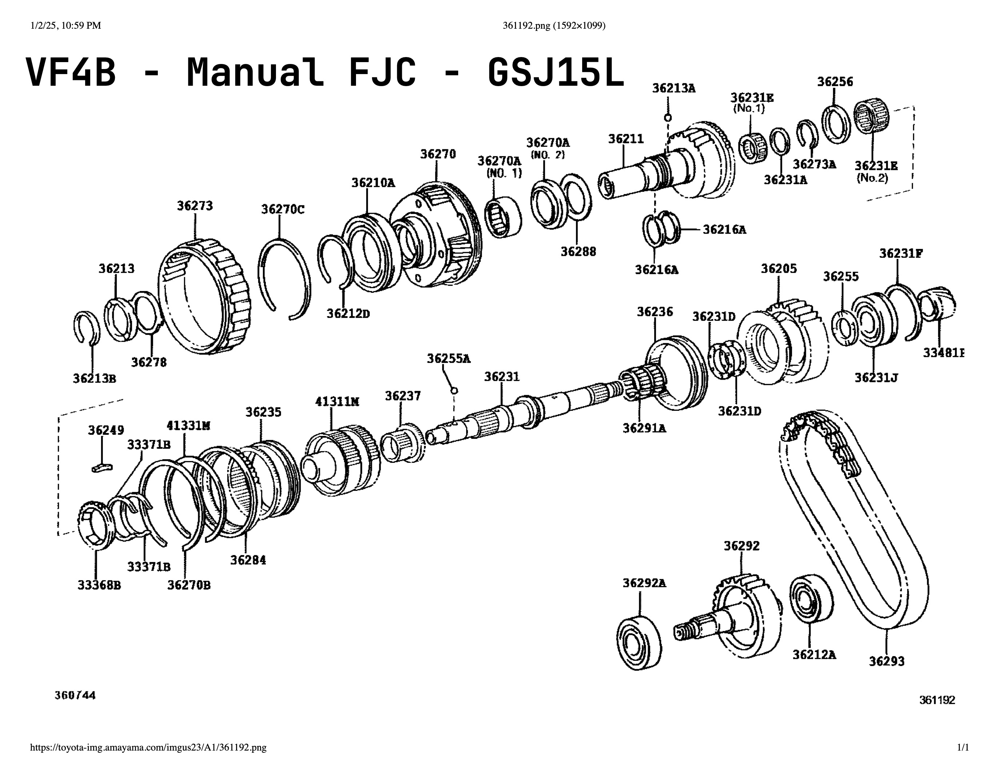
## VF4AM top shift conversion
### Normal Operation
"On the VF4AM there are 3 shafts - 2 moveable and 1 fixed. The H-L is basically the same as the Tacoma, again using a planetary reduction, the interesting part is the second shaft, which has 3 positions, 2-4F-4L floats the fork on the shaft with end stops (using snap rings) with the shaft using interlock pins to sliders on the fixed shaft prevent the fork from moving in all 3 locations. It's pretty cool ([source](https://www.tacomaworld.com/threads/transfer-case-question.711816/#post-25317689))". [This video](https://www.youtube.com/watch?v=XKFrZr6EcK0) is a good visual of how the transfer case shifts in the factory configuration with the electric actuator. Here is [another good video](https://www.youtube.com/watch?v=ESm0PPBkAQQ&t=1187s) that does a deep dive on transfer case operation, conveniently the AWD demonstration uses the internals from a VF4AM. The following diagrams of the transfer case internals are available on the parts websites found under [this section](#Frame codes for the donors)
### Conversion Overview
Although the VF4AM is an electrically shifted transfer case the rear housing has machined pockets to guide rails for a manual top shifting mechanism. The housing also has the shifter mounting area machined, although in an electric shift application it is covered with a plate containing a small pressure relief vent instead of a shifter. The remainder of the housing has castings for the top shift rail detents and locations for the front clearance holes for the movement in the top shift rails. Since the FJ Cruiser uses a version of this case with a top shift mechanism to convert the case I simply need to add these machined features, add the top shifting rail mechanism from a FJ Cruiser, and adjust the detents in the FJ Cruiser shift rails as needed so the shifter snaps into the correct position for this particular case.
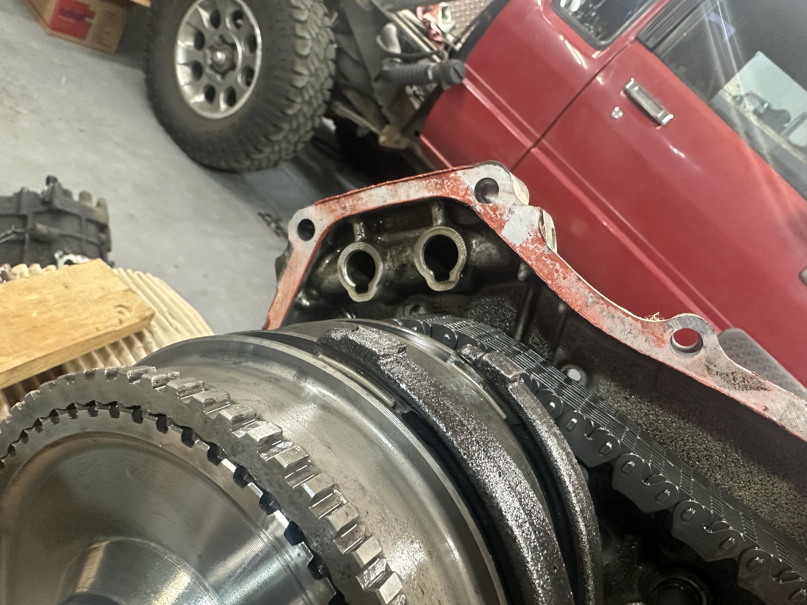
### Frame codes for the donors
Use the frame codes get detailed parts and diagrams from any of the following sources:
- [Amayama](https://www.amayama.com/)
- [Megazip](https://www.megazip.net)
- [PartSouq](https://partsouq.com)

FJ Cruiser w.  RA61F 6 speed and fully manual VF4B
- GSJ15L
- reference VIN from salvage site - JTEBU11F970052528)
4th gen 4Runner w/ 1GRFE, A750, and fully electric VF4AM
- GRN215
- currently no reference vin
### OEM FJ Cruiser Parts
The following parts were identified from the parts diagram for the shifter assembly of a GSJ15L frame FJ Cruiser. All the parts below the red line are part of the internal shift mechanism

| Part Number | Description                                 | Quantity |
| ----------- | ------------------------------------------- | -------- |
| 36302-60190 | FORK, TRANSFER GEAR SHIFT, NO.2             | 1        |
| 36313-60140 | SHAFT, TRANSFER FRONT DRIVE SHIFT           | 1        |
| 36314-60120 | SHAFT, TRANSFER HIGH AND LOW SHIFT FORK     | 1        |
| 36315-60030 | HEAD, TRANSFER GEAR SHIFT, NO.1             | 1        |
| 36317-35020 | STOPPER, TRANSFER SHIFT SHAFT               | 3        |
| 36317-60020 | STOPPER, NO.2, TRANSFER SHIFT SHAFT         | 1        |
| 41408-60030 | FORK SUB-ASSY, CENTER DIFFERENTIAL LOCK     | 1        |
| 90250-10020 | PIN OR ROLLER, SHIFT INTER-LOCK             | 1        |
| 90254-05001 | PIN                                         | 3        |
| 90311-15008 | SEAL, OIL                                   | 2        |
| 90341-12014 | PLUG (FOR REVERSE RESTRICT PIN)             | 2        |
| 90360-10003 | BALL (FOR 2ND GEAR BUSH)                    | 2        |
| 90501-16116 | SPRING, COMPRESSION (FOR SHIFT DETENT BALL) | 2        |
| 90501-18128 | SPRING, COMPRESION (FOR SHIFT FORK)         | 2        |
| 90520-13002 | RING, SNAP                                  | 2        |
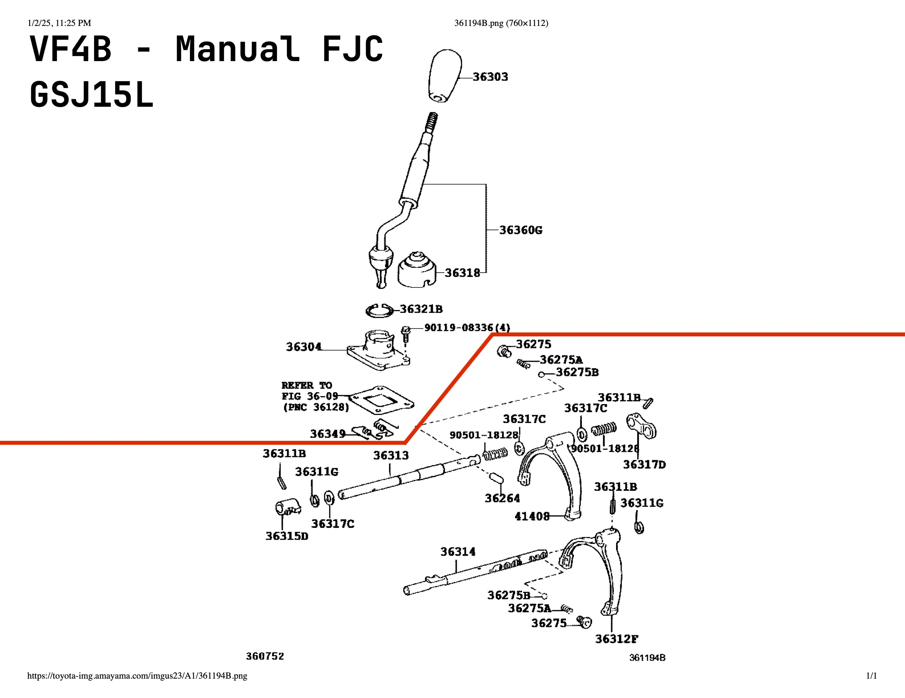
### Conversion Process
The new shift assemblies are comprised of 3 pieces. 
	- A new shift rail made from the 15mm rod
	- A new shift flags, the part with the teeth that engage with the shift lever
	- An OEM Toyota shift fork
Each shift assembly has one shift rail with appropriate detent cuts, one shift flag pinned in place, and one shift rail pinned in place.
#### Parts
The OEM shift rails are 15mm hardened and ground steel rod. I used 1045 15mm rod from [McMASTERCARR](https://www.mcmaster.com/5615N15) to make the new shift rails. The shift flags are made from 20x50mm 1045 bar stock also from [McMASTERCARR]([6545K205](https://www.mcmaster.com/6545K205)). I reused detent balls, springs, and plugs from a VF1 that I had on hand. The required Toyota parts are in the following table. Of note the `36313-60140 - SHAFT, TRANSFER FRONT DRIVE SHIFT` on the passenger side of the case has a section that is 17mm diameter where the `41408-60030 - FORK SUB-ASSY, CENTER DIFFERENTIAL LOCK` shifting fork installs. For this reason I recommend using a pair of `36302-60190 - FORK, TRANSFER GEAR SHIFT, NO.2` instead as they both fit a 15mm shaft. The shift fork can be difficult parts to source. I tried multiple vendors including [Amayama](https://www.amayama.com), [MegaZip](https://www.megazip.net), [Partsouq](https://partsouq.com), and multiple dealers without any luck before finally placing a successful order through [ToyotaPartsDeal](https://www.toyotapartsdeal.com).

| 36302-60190 | FORK, TRANSFER GEAR SHIFT, NO.2             | 2   |
| ----------- | ------------------------------------------- | --- |
| 90311-15008 | SEAL, OIL                                   | 2   |
| 90341-12014 | PLUG, SHIFT DETENT BALL SPRING              | 2   |
| 90360-10003 | BALL (FOR 2ND GEAR BUSH)                    | 2   |
| 90501-16116 | SPRING, COMPRESSION (FOR SHIFT DETENT BALL) | 2   |
#### Modifications and Fabrication
##### Front Housing Machining
The front housing of the VF4 case needs guide holes machined into the front mounting flange for the shift rails to ride in. It is also worth adding a counterbore for seals here too. Early cases like the VF1 did not have shift rail seals but all the later ones do. The following image is a front view sketch of the VF4 looking at the face that mounts to the transmission. It has dimensions in millimeters to place the guide holes relative to the center bore for the input shaft bearing (the 110mm diameter circle). 
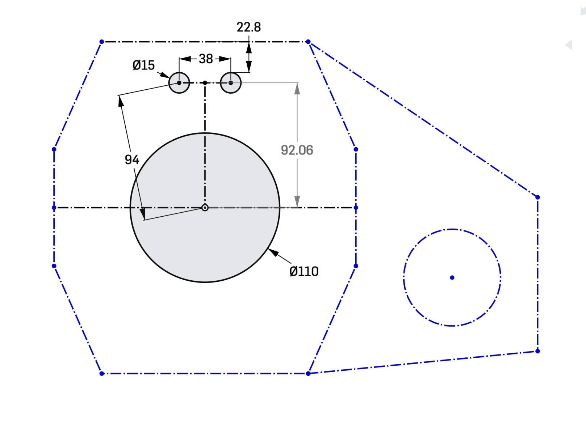

Setup for machining, note the casting has dimples in the rough location of the guide holes. The casting dimples are accurate to within a couple millimeters but are not accurate enough for drilling, milling is a requirement here.
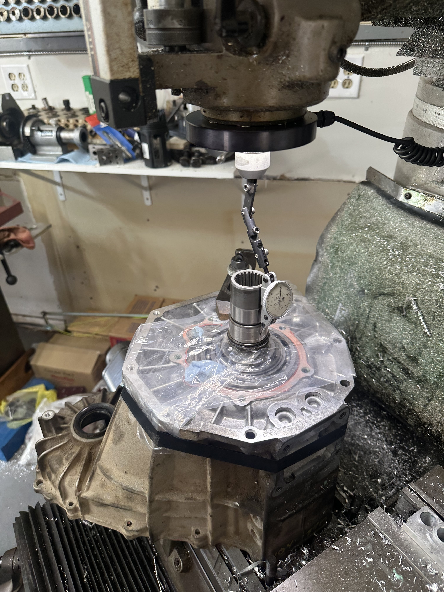
Completed shift rail guide holes with counterbores for the seal. 
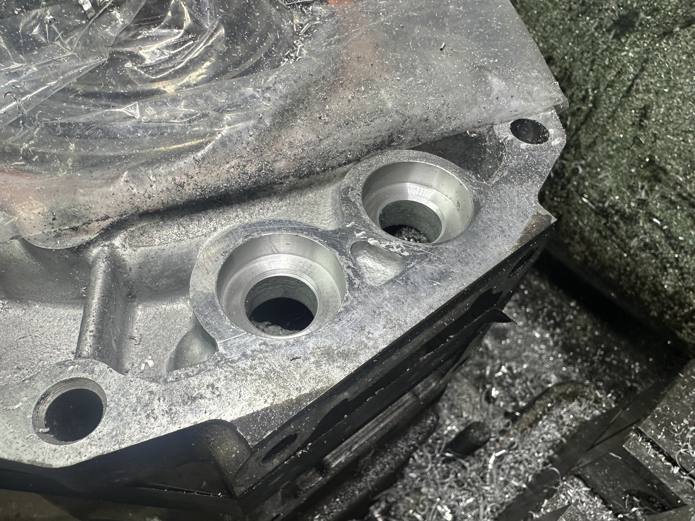
##### Rear Housing Modification
The rear housing of the VF4 is already machined from the factory with guides for the shift rails.

The only modification necessary is drilling and tapping the holes for the detent balls, springs, and plugs. There are preexisting casting holes on the rear housing in the location the detents that can be used as drilling guides for the detent holes. Through drill them at 10mm so the detent ball can drop freely into the shift rail guide holes. Then tap the hole to M12x1.25 at a depth that allows the detent plug to fully thread and seat.
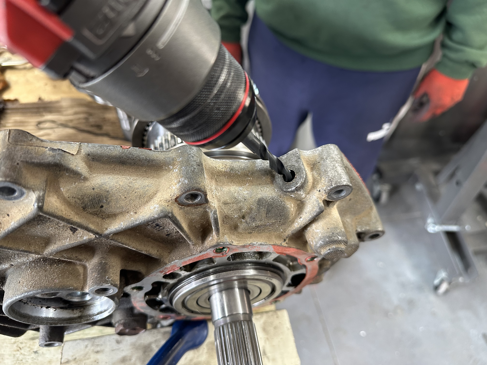
##### Shift Rails
There are two shift rails, the high/low rail which selects either high range or low range. There cannot be a neutral detent with this system as the detent is too close to the other detents. Toyota addresses this problem the FJ Cruiser VF4B with a different style detent located inside the high/low gear assembly. That system does not appear to be a retrofit option for the VF4AM so another transfer case neutral selection will need to be worked out later. The second shift rail is the drive mode rail, which has detents for 2WD, AWD, and 4WD. In a typical manually operated VF type transfer case the driver side shift rail controls high/low selection and the passenger rail controls 2WD/4WD. However, to fit the additional AWD shift mode in this conversion the shift rails will be opposite this standard. This is because the rear guide pocket on the driver side is deeper than the passenger side and as a result provides clearance for an additional detent. The following drawings show the final locations of the shift rail detents as well as the detent geometry. The detents are shallower than the OEM Toyota detents. The shallower detent is required on the drive mode shift rail to add a 3rd position for AWD and was kept on the high/low shift to ensure a consistent feel for all shifting actions. 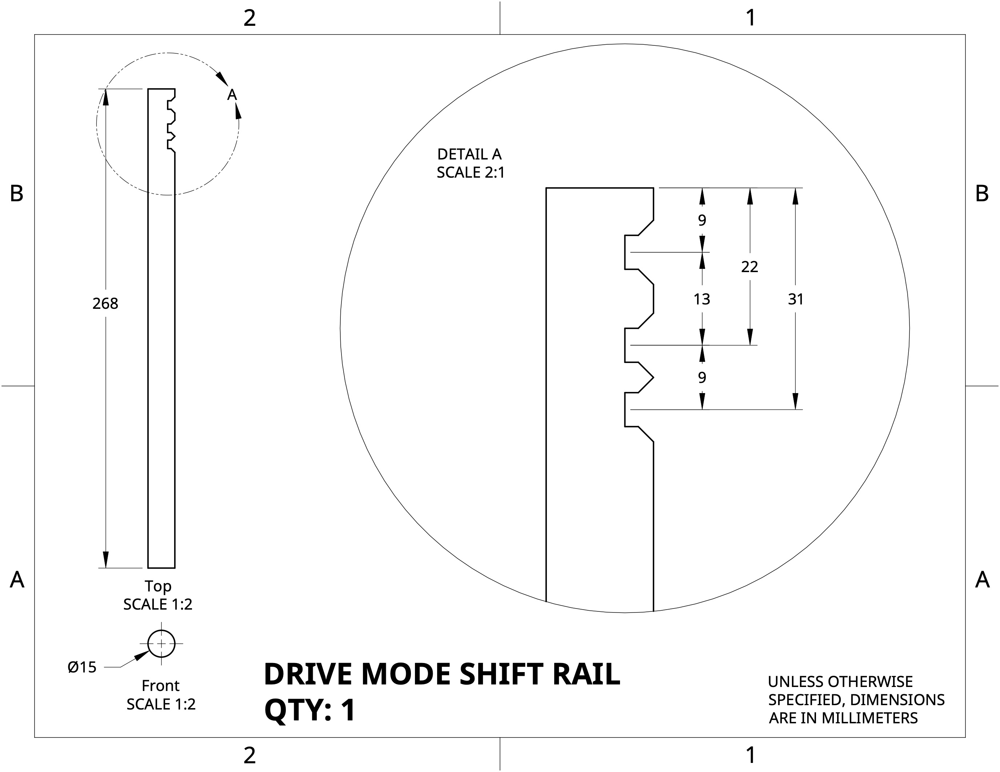
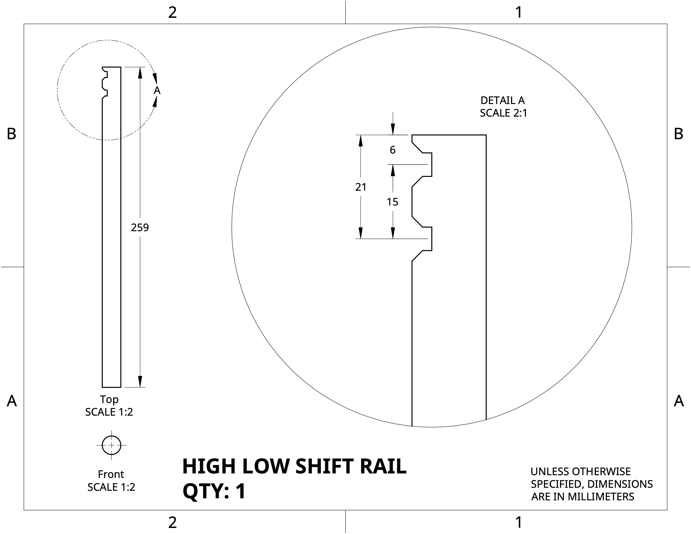
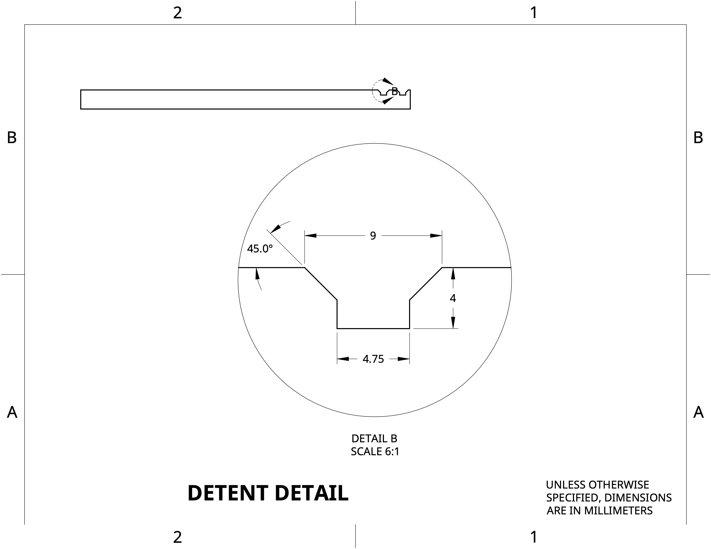
Additionally, the drive mode shift rail has a sharp point between two of the detent locations. To prevent gouging and binding in the aluminum housing guides relieve this point (circled in red) slightly.
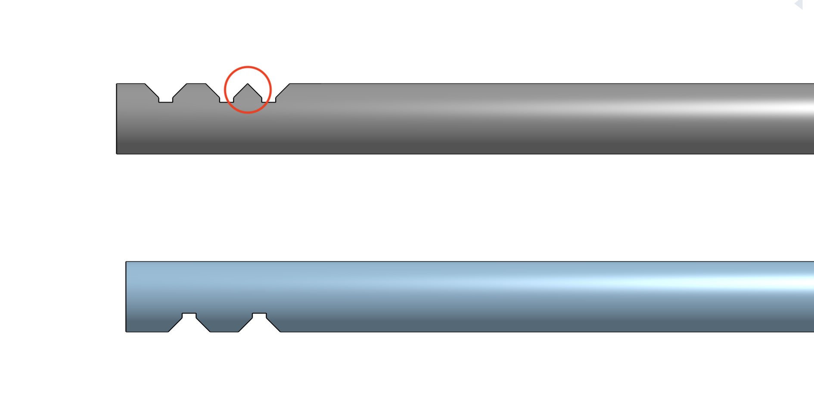
##### Shift Flags
To ease fabrication and assembly, the part of the shift rail that interacts with the shift lever was manufactured separately from the shift rail. These components are called the shift flags and are positioned and pinned in place as the final step in the process. Dimensions are shown in the following drawing.
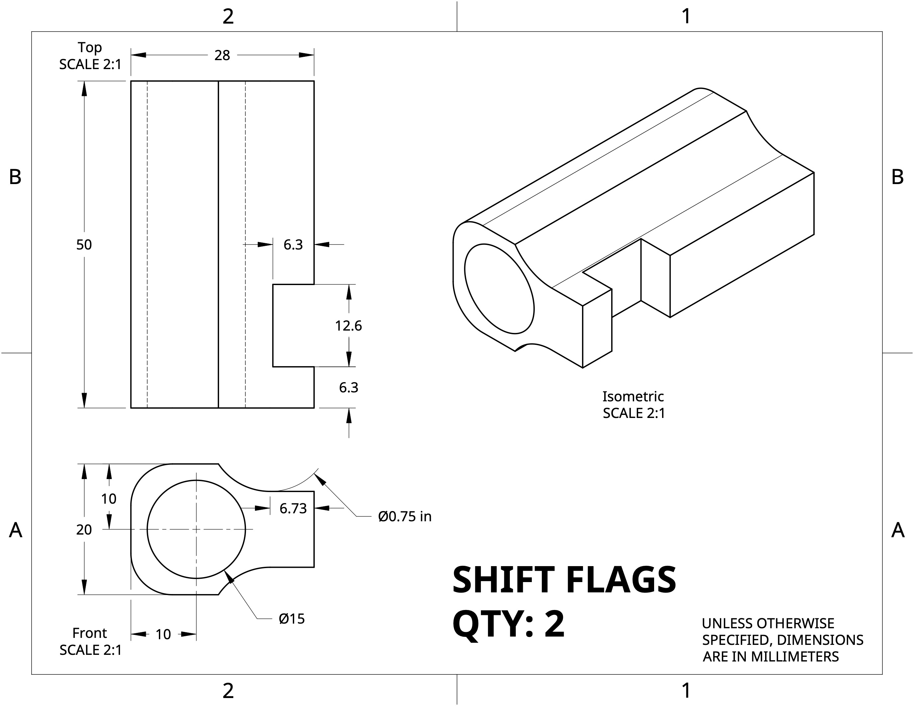
The lower inner corners (circled in red) may need additional relief to clear the planetary gear assembly. This can be accomplished with either hand tools or machine tools.
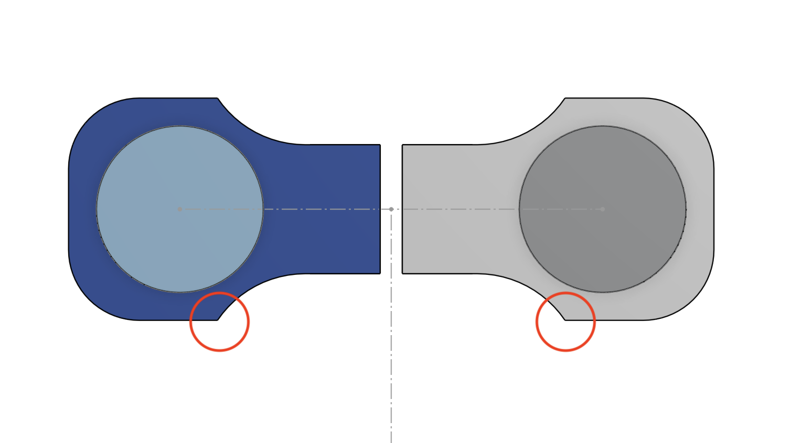
##### Shift Rail Assembly
Each shift rail has a shift fork and a shift flag pinned in place. Because the detent holes are drilled freehand using the raw casting as a guide each shift fork and flag needs to be located and drilled in-situ to account for any deviations from square in the drilled detent holes. Of note, when locating the shift forks ensure the planetary gear output assembly is correctly spaced from the differential assembly. Toyota includes a spacer between these two assemblies, in the following diagram it is part number 36231A.

However, when fully assembled in the housing the location of the two main gear assemblies is determined by large retaining rings on the shaft bearings. In this particular case the spacer bushing was approximately 2mm too thin to correctly locate the planetary output shaft to the differential input shaft which resulted in incorrectly positioned shift forks. A temporary spacer was fabricated to correctly locate everything while setting the final position of the shift forks and shift flags.

## VF4 Speedometer Adaption
Many modern Toyota 4x4's pull vehicle speed information from the ABS system and do not include a dedicated vehicle speed sensor anywhere in the drivetrain. For VF4 applications, only the 2005-2007 Sequoia (frame code UCK45L-GKBLKA) FJ Cruisers equipped with a manual transmission (frame code GSJ15L) have a VSS. Any VF4 can be adapted to use a speed sensor or mechanical speedometer drive assembly for a cable speedometer, but the rear transfer case housing extension must be sourced (part number 36105-60040) either from a supplier or a donor Sequoia/FJ Cruiser transfer case. The VF4 family of transfer cases uses a larger rear bearing than the more common VF1/2/3 cases and as a result has a unique housing extension.
### Transfer Case Housing Extension
The VF cases all have a housing extension at the back that supports the rear bearing for the main shaft and houses the seals for the drive flange. In VSS equipped models it also houses the gears for the speedometer. The VF4 uses a larger rear bearing than any of the other VF series cases. Since the rear housing provides some support for that bearing this means the VF4 has a unique housing extension. Left is a 2006 VF4 housing extension and right is a 1988 VF1 extension, the VF4 rear bearing is nearly 0.5" larger in diameter. However, the bolt pattern is the same on both parts so either part can bolt onto any VF series case, although it will not have proper bearing support.  
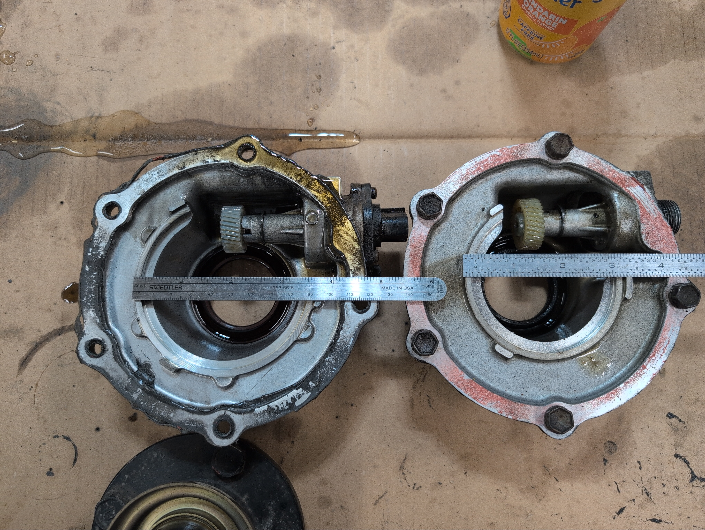
### Cable Driven Speedometer vs VSS
Top is an original 1988 speedometer cable drive assembly from a VF1 transfer case, bottom is a vehicle speed sensor from a 2006 Sequoia. They fit interchangeably in the transfer case housing extension. However the gears are not interchangeable between the two parts.  
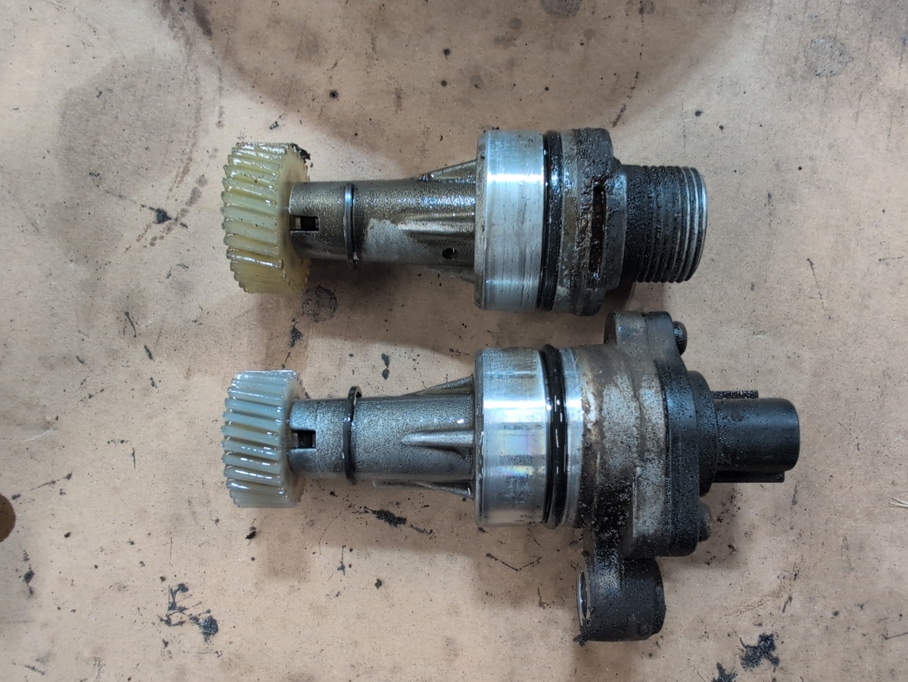
### Drive Gear Differences
Although the number of teeth on the worm gear is the same in the two cases, the VF4 uses a slightly larger worm gear paired with a smaller driven gear. Shown below on the left is the VF4 parts with the VF1 parts on the right. There is about 2.5mm of difference in the diameters of the comparable parts between the generations. Unfortunately this means the VF4 worm gear is not compatible with the VF1 driven gear and vice-versa.
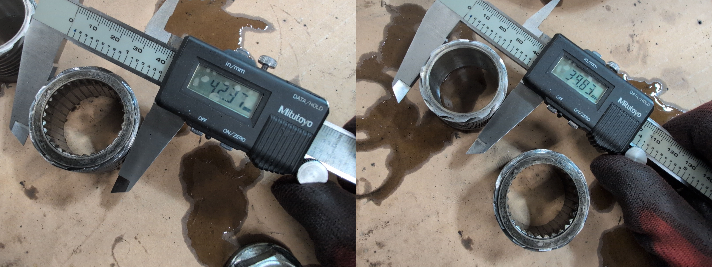
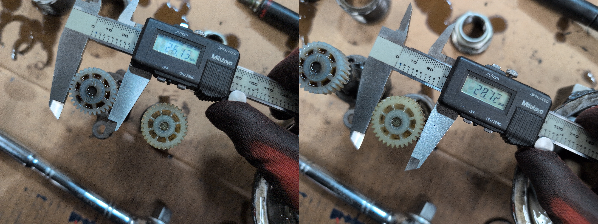
Note the VF4 worm gear (left) interfaces with the main shaft via a splined section at the front of the gear, where the VF1 gear is smooth (right). The VF1 instead used a ball detent in the main shaft that interfaced with a small notch in the worm gear to ensure it was driven by the main shaft. There is no provision for a ball detent on the VF4.
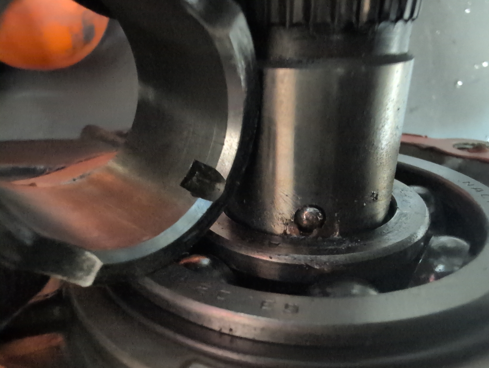
When the output flange is assembled, with the housing left off for inspection, the entire assembly is in compression and it appears the drive mechanism (either splines or ball detent) is redundant and only there to ensure the worm gear does not slip. With the output flange nut snug (not torqued) it was impossible to fit a 0.001" shim between any of the parts so it is likely the VF1 worm gear will work in a VF4 case without any provision to lock it's rotation to the main shaft as this is not a high-torque system. However for extra security splines can be added to the older VF1 worm gear to replicate they OEM Toyota system.
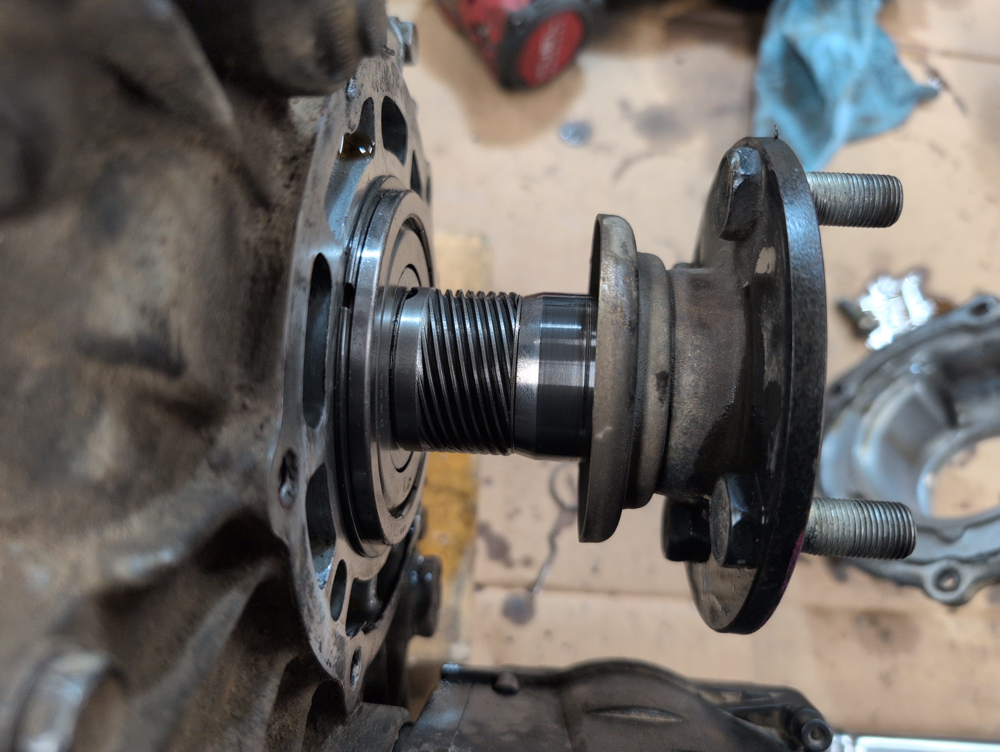
### Adding Splines